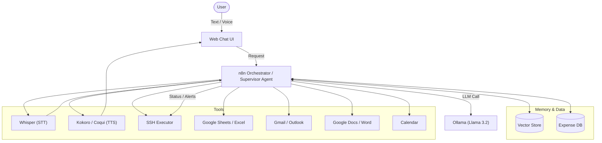

Here is a comprehensive Project Plan in `README.md` format, incorporating all your specified features, tools, and workflows.

***

# 🧠 AI Personal Operations Center (POC) - "The Second Brain"

## 📖 Overview
This project represents a local-first, privacy-focused **Agentic Operations Center**. It acts as an autonomous assistant capable of handling complex multimodal inputs (Voice, Text), executing secure system operations (SSH), managing personal finance, and proactively organizing daily life through a "Supervisor" agent architecture.

The system is fully containerized using **Docker**, orchestrating **Ollama** (Local LLM), **n8n** (Workflow Automation), and various tool integrations into a unified, observable ecosystem.

***

## 🏗 System Architecture

The following diagram illustrates the flow of data between the User, the Supervisor Agent, and the main tools, all inside your own UI and terminal environment.




***

## 🛠 Tech Stack

| Component | Technology | Docker Image |
| :--- | :--- | :--- |
| **Orchestration** | n8n | `n8nio/n8n:latest` |
| **LLM Backend** | Ollama (Llama 3.2) | `ollama/ollama:latest` |
| **Speech-to-Text** | Whisper (Local) | `openai/whisper` (or `faster-whisper-server`) |
| **Text-to-Speech** | Kokoro / Coqui TTS | `ghcr.io/coqui-ai/tts` |
| **Database** | PostgreSQL / Vector Store | `postgres:16` / `chromadb` |
| **Code Sandbox** | Python Container | `python:3.11-slim` (with Pandas, Matplotlib) |
| **Frontend UI** | Streamlit / Open WebUI | `streamlit` or `open-webui` |
| **Observability** | LangFuse | `langfuse/langfuse` |

***

## 🚀 Core Features & Workflows

### 1. 🎙️ Multimodal Voice Interface ("Walk & Talk")
**Goal:** Hands-free interaction while walking.
*   **Workflow:**
    1.  **Input:** User sends Voice Note via Telegram.
    2.  **Transcribe:** n8n Webhook receives audio $\to$ sends to **Whisper Container**.
    3.  **Think:** Transcribed text $\to$ **Ollama** (Llama 3.2) for processing.
    4.  **Speak:** LLM response $\to$ **Kokoro TTS** $\to$ Audio File.
    5.  **Output:** n8n sends Audio File back to Telegram as a reply.

### 2. 👮 Supervisor & Sub-Agents Pattern
**Goal:** Break down complex tasks into atomic actions.
*   **Supervisor Agent:** Analyzes intent and routes to specific workers.
    *   **Worker A (Search):** RAG search over emails/docs.
    *   **Worker B (Analyst):** Uses "Code Interpreter" to analyze data.
    *   **Worker C (Writer):** Formats final output (PDF/Markdown).

### 3. 🛡️ Secure SSH & Human-in-the-Loop
**Goal:** Execute terminal commands safely without accidental destruction.
*   **Security Layer:**
    1.  **Draft:** Agent proposes `rm -rf /logs`.
    2.  **Critic Audit:** A separate "Critic" model prompt: *"User wants to run `rm -rf /logs`. Is this safe? Respond YES/NO."*
    3.  **Human Gate:** If Critic is unsure or command is high-risk $\to$ Send Telegram Button: **[Approve] / [Deny]**.
    4.  **Execution:** Only runs upon explicit click.

### 4. 🧠 Long-Term Memory (Context Preservation)
**Goal:** Continuity across sessions.
*   **Session Start:** Workflow reads `Summary.md` (high-level user profile) before processing the first query.
*   **Session End (Batch):** Every 10 turns, a background job summarizes the interaction and updates `user_profiles` in the Vector Store.
*   **Recall:** Uses semantic search to retrieve "User preferences for Python projects" when relevant.

### 5. 💰 Expenditure Tracking & Visualization
**Goal:** Frictionless expense logging with visual insights.
*   **Input:** User texts: *"Spent $50 on lunch."*
*   **Extraction:** Agent extracts `{"amount": 50, "category": "Food", "date": "2025-01-27"}`.
*   **Storage:** Appends to SQL Database or Google Sheet.
*   **Visualization:**
    *   **Trigger:** User asks *"Show my monthly spending."*
    *   **Action:** Python Sandbox queries DB $\to$ Generates Pie Chart (`matplotlib`) $\to$ Saves image.
    *   **Output:** Image sent to Chat UI / Telegram.

### 6. 🌅 "Morning Analyst" Briefing
**Goal:** Executive summary delivered at 7:00 AM.
*   **Trigger:** Cron Schedule (07:00).
*   **Data Sources:**
    *   **Calendar:** Fetch today's events.
    *   **Gmail:** Filter for "Urgent" or domain `*@hsbc.com` received overnight.
    *   **Markets:** Python script calls `yfinance` (S&P 500 close, HKD/USD).
*   **Synthesis:** Agent generates a structured briefing with "Action Items".

***

## 📂 Folder Structure

```text
/ai-poc-project
├── docker-compose.yml       # Orchestrates n8n, ollama, whisper, db
├── .env                     # API Keys (Telegram, Google, OpenAI if needed)
├── /n8n_workflows           # JSON exports of n8n flows
│   ├── supervisor_agent.json
│   ├── voice_pipeline.json
│   └── morning_briefing.json
├── /python_sandbox          # Scripts for code interpreter
│   ├── market_data.py
│   └── generate_chart.py
├── /memory                  # Local storage for context
│   ├── summary.md
│   └── vector_store/
└── /data                    # Persistent volume data
```

***

## 🗓 Implementation Roadmap

### Phase 1: Foundation (Days 1-2)
- [ ] Set up `docker-compose.yml` with Ollama, n8n, and PostgreSQL.
- [ ] Connect Telegram Bot API to n8n Webhook.
- [ ] Verify Ollama is running `llama3.2` locally.

### Phase 2: The Brain & Tools (Days 3-5)
- [ ] Build the **Supervisor Agent** node in n8n.
- [ ] Integrate **Google Workspace** (Gmail/Calendar/Sheets) credentials.
- [ ] Implement **SSH Tool** with the "Human-in-the-Loop" Telegram button.

### Phase 3: Voice & Multimedia (Days 6-7)
- [ ] Deploy **Whisper** and **TTS** containers.
- [ ] Create the Audio processing workflow (Audio $\to$ Text $\to$ AI $\to$ Audio).

### Phase 4: Memory & Analysis (Days 8-10)
- [ ] Set up the **Expense Database** and Python Chart generation script.
- [ ] Implement the **"Read Summary.md"** logic at start of chat.
- [ ] Configure **LangFuse** for observability.

***

## 🗓 Workload Partitioning (3-Part Split)

To ensure manageable development, the project is divided into three equal workload sprints.

### Part 1: Core Infrastructure & Basic Orchestration
**Focus:** Setting up the "Body" (Docker/n8n) and "Brain" (Ollama) to establish basic communication.
*   [ ] **Infrastructure:** Configure `docker-compose.yml` with **n8n**, **Ollama** (pull `llama3.2`), **PostgreSQL**, and **LangFuse**.
*   [ ] **Interface:** Connect **Telegram Bot API** to n8n Webhook for text-based chat.
*   [ ] **Orchestration:** Build the foundational **Supervisor Agent** node in n8n to route basic "Chat" vs. "Task" intents.
*   [ ] **Observability:** Initialize **LangFuse** to trace LLM thoughts and debug the initial agent logic.
*   [ ] **Interface:** Make up and design the UI interface for the project ( streamlit/ Javascript) 

### Part 2: Tools, Security & Analytics
**Focus:** Giving the agent "Hands" (SSH/Tools) and "Eyes" (Google/Data) to perform work.
*   [ ] **Integrations:** Configure **Google Cloud Console** credentials for Gmail, Calendar, and Sheets access.
*   [ ] **Secure Ops:** Implement the **SSH Tool** with the "Human-in-the-Loop" Telegram button flow (Draft $\to$ Approve $\to$ Execute).
*   [ ] **Data Analysis:** Set up the **Python Sandbox** container and write the script for generating **Expense Charts** (`matplotlib`).
*   [ ] **Workflow:** Create the **"Morning Analyst"** automation to aggregate Calendar and Gmail data into a daily text summary.

### Part 3: Voice, Memory & Advanced Synthesis
**Focus:** Adding the "Ears/Voice" (Multimedia) and "Soul" (Long-term Context).
*   [ ] **Multimedia Stack:** Deploy **Whisper** (STT) and **Kokoro/Coqui** (TTS) containers to the Docker stack.
*   [ ] **Voice Pipeline:** Build the n8n workflow for **Audio Note $\to$ Transcript $\to$ LLM $\to$ Audio Reply**.
*   [ ] **Long-Term Memory:** Implement the **Vector Store** (ChromaDB/Pgvector) logic to read/write user facts.
*   [ ] **Context Injection:** Create the pre-prompt logic to read `summary.md` and inject user preferences into every new session.

***

## 🚦 Getting Started

1. **Clone & Setup:**
   ```bash
   git clone https://github.com/yourname/ai-poc.git
   cd ai-poc
   cp .env.example .env
   ```

2. **Launch Stack:**
   ```bash
   docker-compose up -d
   ```

3. **Initialize Models:**
   ```bash
   docker exec -it ollama ollama run llama3.2
   ```

4. **Connect n8n:**
   Open `http://localhost:5678`, import workflows from `/n8n_workflows`, and authenticate Telegram/Google.
